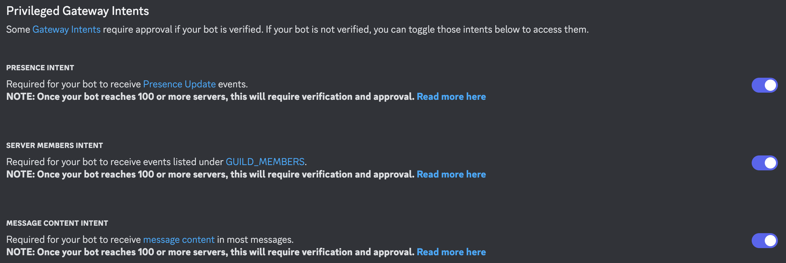
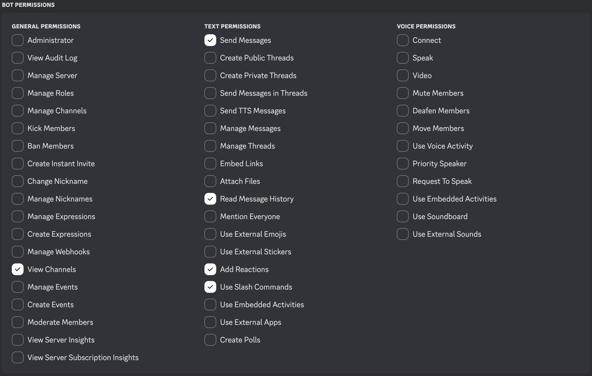
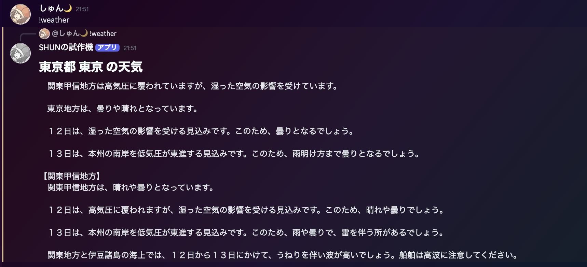
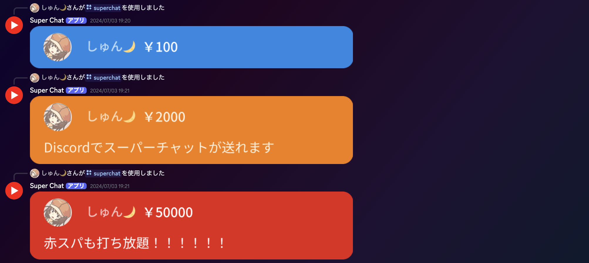
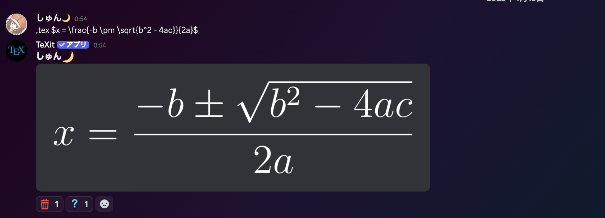
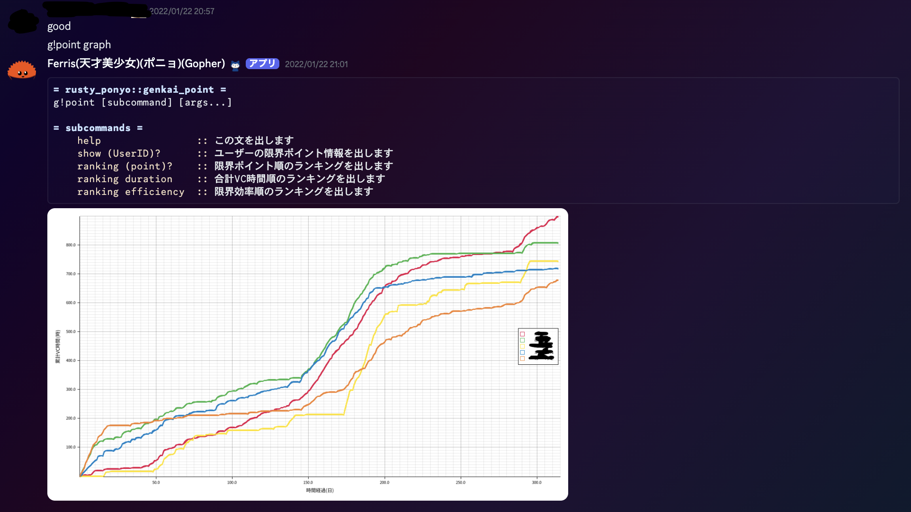

# Discord Botで始める <br> プログラミング入門講座

2025/04/16

しゅん<twemoji-crescent-moon /> (@shun_shobon)

---
layout: image-right
image: /assets/meru.png
---

## 自己紹介 <twemoji-pencil />

- 名前: しゅん<twemoji-crescent-moon /> (@shun_shobon)
- 所属: 知能情報システム(AS) B4
- 分野: Web技術, ネットワーク, デザイン
- 趣味: マイクラ, 音ゲー, etc...

---

## 今日の目標 <twemoji-chequered-flag />

1. JavaScriptが一通り使えるようになる！
2. Discord Botを作れるようになる！
3. プログラミングの楽しさを知る！

<br>
<br>

## おことわり

- 今日はとりあえず「動くもの」を作ることを目指します。そのため、細かい説明を省略している部分があります。もしわからない事があれば、TAなどに遠慮なく聞いてください！
- 進行の都合上、ある程度できる人には退屈な時間があるかもしれません。その場合はどんどん次のステップに進んでもらっても大丈夫です。
- **全てを講座通りに作る必要はありません！むしろ積極的な改変・改造を推奨しています！**

---

## 環境構築 <twemoji-building-construction />

今回使用するプログラミング言語はJavaScript <logos-javascript /> です。
JavaScriptは元々Webブラウザで動く言語でしたが、Node.jsの登場により今では様々な用途で使われています。

以下のツールをインストールします。

- VSCodeのインストール
- Gitのインストール
- miseのインストール(Node.jsのインストール)

---

### VSCodeのインストール <logos-visual-studio-code />

VSCodeはMicrosoftが開発しているオープンソースのエディタです。
拡張機能が豊富で、JavaScriptの開発にも最適です。

[公式サイト](https://code.visualstudio.com/)からダウンロードも可能ですが、今どきのOSならCLIからインストールするのが楽です。
<br>
(すでにインストール済みの場合はそのままでOKです)

###### Windows:
```bash
winget install Microsoft.VisualStudioCode
```

###### Mac:
```bash
brew install visual-studio-code
```

Linuxはディストリビューション毎に異なるので各自調べてください。

インストールできたら、以下コマンドで起動できるか確認してください。

```bash
code
```

---

### Gitのインストール <logos-git-icon />

Gitはバージョン管理システムです。主にソースコードの管理・チーム開発に使用されますが、レポートやドキュメントの管理にも使えます。
今回はGitHubというサイトからソースコードを落とすためだけに使います。

これもCLIからインストールするのが楽です。

###### Windows:
```bash
winget install Git.Git
```

###### Mac:
```bash
brew install git
```

インストール後、`git`コマンドが使えるようになっているか確認してください。

```bash
git --version
```

---

### miseのインストール <logos-terminal />

miseは開発に使用するツールを簡単にインストールできるCLIツールです。
<br>
今回はNode.jsのインストールに使用します。

[公式サイト](https://mise.jdx.dev/getting-started.html)の手順に従ってインストールしてください。

###### Windows:
```bash
winget install jdx.mise
```

###### Mac:
```bash
brew install mise
```

---

### miseのインストール <logos-terminal />

**インストール後に「Activate mise」の手順も行います。**

###### Windows:
```bash
$shimPath = "$env:USERPROFILE\AppData\Local\mise\shims"
$currentPath = [Environment]::GetEnvironmentVariable('Path', 'User')
$newPath = $currentPath + ";" + $shimPath
[Environment]::SetEnvironmentVariable('Path', $newPath, 'User')
```

###### Mac:
VSCodeとの連携の都合上、Macの場合は[shims](https://mise.jdx.dev/dev-tools/shims.html)のパス追加も必要です。
```bash
echo 'eval "$(mise activate zsh --shims)"' >> ~/.zprofile
echo 'eval "$(mise activate zsh)"' >> ~/.zshrc
```

ターミナルを再起動した後、以下のコマンドで正しくインストールされているか確認できます。

```bash
mise doctor
```

**これにて環境構築は完了です。お疲れ様でした <twemoji-party-popper />**

---

## ソースコードの準備 <carbon-code class="text-blue-500" />

今回使用するソースコードはGitHubで公開しています。

https://github.com/tuatmcc/discord-bot-hands-on

「Code」→「HTTPS」をクリックして表示されるURLをコピーしてください。

コピーしたURLを使って、以下のコマンドでソースコードをクローンします。

```bash
git clone https://github.com/tuatmcc/discord-bot-hands-on.git
```

クローンすると、`discord-bot-hands-on`というディレクトリが作成されます。それをVSCodeで開いてください。
VSCodeから開くこともできますし、以下のコマンドを使ってCLIから直接開くこともできます。

```bash
code discord-bot-hands-on
```

---

## プロジェクトの初期化 <twemoji-hammer-and-wrench />

VSCodeで開くと、まずワークスペースを信頼するかたた聞かれるため、「信頼」を選択してください。
<br>
また、推奨される拡張機能が右下に表示されるので、インストールしてください。
<br>
インストール後、VSCode上でターミナルを開き、以下のコマンドを実行してNode.jsのインストールと依存関係のインストールを行います。

```bash
# Node.jsのインストール
mise trust && mise install

# 依存関係のインストール
npm install
```

リポジトリには以下のようなものが含まれています。(詳細は`README.md`を参照してください)

- `src/`: ソースコードのディレクトリ。この中のコードを編集してプログラミングしていきます。
- `package.json`: プロジェクトの設定ファイル。依存関係やスクリプトが定義されています。
- `package-lock.json`: 依存関係のバージョンが書かれるファイル。直接編集することはありません。
- `node_modules/`: 依存関係がインストールされるディレクトリ。直接編集することはありません。
- `.vscode/`: VSCodeの設定や拡張機能の設定が含まれています。

---

## Botアカウントの作成 <logos-discord-icon />

[Discord Developer Portal](https://discord.com/developers/applications)にアクセスしてBotアカウントを作成します。

1. 「New Application」をクリックして、好きな名前を入力して「Create」をクリックします。
2. 左側のメニューから「Bot」を選択し、「Privileged Gateway Intents」の欄の3つのスイッチを全てONにします。
   {width=90%}
3. 「Save Changes」をクリックして設定を保存します。

<!--
[メモ]: Privileged Gateway Intentsの説明
Intentsの設定はBotが受信するイベントの種類を設定するものです。
ただ、一部のイベントはプライバシーの観点でデフォルトでOFFになっており、更に100サーバー以上に参加しているBotの場合はONにするために申請が必要です。
今回は開発を楽にするため、プライバシーなどは考慮せず全てONにしています。
-->

---

## Botアカウントの作成 <logos-discord-icon />

4. 左側のメニューから「OAuth2」を選択します。
5. 「OAuth2 URL Generator」の欄で「Scopes」で`bot`を選択します。
6. 「Bot Permissions」の欄が出現するので、以下の権限にチェックを入れてください。
   <br>
   `View Channels`, `Send Messages`, `Read Message History`, `Add Reactions`, `Use Slash Commands`
   <br>
   {width=50%}
7. 一番下の「Generated URL」にあるURLをコピーします。

<!--
[メモ]: Permissionの説明
PermissionはBotがサーバーで実行できる操作の種類を設定するものです。
今回はBotがメッセージを送信したり、リアクションを追加したりするための権限を設定しています。
(今回の講習では使わない権限もありますが、一般的なBotに必要な権限を設定しています)
-->

---

## Botアカウントの作成 <logos-discord-icon />

8. コピーしたURLをブラウザに貼り付けて、Botをサーバーに追加します。
  <br>
  (テスト用に適当なサーバーを作っておくと便利です！)
9. うまくいけば、サーバーにBotが追加されています 🎉

{width=30%}

---

## Botアカウントの作成 <logos-discord-icon />

10.  再度左側のメニューから「Bot」を選択し、「Reset Token」をクリックしてトークンを生成します。
11. トークンをコピーしておきます。コピーしたトークンは次のステップで使用します。
    <br>
    なお、トークンは一度しか表示されないため、注意してください。(再生成は可能です)
    <br>
    **トークンは非常に大切な情報です！アカウントのパスワードなどと同様、絶対に他人に教えないでください。**

---

## プログラムを動かしてみる <twemoji-fast-forward-button />

まずは、プログラムを動かしてみます。
プログラムの動作にはBotのトークンが必要です。

`.env`を作成して、以下のように記述してください。

```bash
DISCORD_BOT_TOKEN = "<先ほどコピーしたBotのトークン>"
```

以下のコマンドでプログラムを実行します。

```bash
npm run start
```

初めから書かれているコードはオウム返しするだけのBotです。
何かしらメッセージを送ると、Botが同じメッセージを返してくれます。


なお、終了したい場合は`Ctrl + C`/`Command + C`で終了できます。

<!--
[メモ]: .envの存在理由を説明する。
先ほども書いた通り、トークンは非常に大切な情報です。
ソースコードはGitHubなどで公開することがあるため、.envといったファイルに分けて管理することが一般的です。

[メモ]: オウム返しをちゃんとしてくれるか、きちんと確認する。
-->

---

## ソースコードを読んでみる <twemoji-open-book />

`src/app.js`を開いてソースコードを見てみましょう[(ソースコード)](https://github.com/tuatmcc/discord-bot-hands-on/blob/732f8014b8de787d81ca5683796aa150e7fc19e8/src/app.js)。

````md magic-move {lines: true}
```js {*}
import { Client } from "discord.js";

const client = new Client({
  intents: ["Guilds", "GuildMembers", "GuildMessages", "MessageContent"],
});

client.on("ready", () => {
  console.log(`Logged in as ${client.user.tag}!`);
});

client.on("messageCreate", async (message) => {
  if (message.author.bot) return;

  console.log(`Message received: ${message.content}`);

  await message.reply(message.content);
});

client.login(process.env["DISCORD_BOT_TOKEN"]);
```

```js {*|1-2|4-8}
// ライブラリのインポート
import { Client } from "discord.js";

// クライアントを作成
const client = new Client({
  // Botの動作に必要な権限を指定
  intents: ["Guilds", "GuildMembers", "GuildMessages", "MessageContent"],
});
```

```js {*|1-5|3-4|7-17|9-10|12-13|15-16|19-20}
// Botの準備ができたら実行される
client.on("ready", () => {
  // Botの名前を表示
  console.log(`Logged in as ${client.user.tag}!`);
});

// メッセージを受信したら実行される
client.on("messageCreate", async (message) => {
  // Botが送信したメッセージは無視する(無限ループ防止)
  if (message.author.bot) return;

  // 受信したメッセージをコンソールに表示
  console.log(`Message received: ${message.content}`);

  // 受信したメッセージをそのまま返信
  await message.reply(message.content);
});

// Botを起動
client.login(process.env["DISCORD_BOT_TOKEN"]);
```
````

<!--
ソースコードを上から順に説明する。

[click]: 最初の方の説明
[click]: discord.jsはDiscordのBotを作成するためのライブラリです。`import`でインポートしています。
[click]: ClientはBotの各種操作やイベントを受け取るためのクラス(クラスの説明はなくてもOK)。IntentsはBotが受信するイベントの種類を指定するもの。今回は詳細な説明はなくてOK。

[click]: 後半の方の説明
[click]: `.on`はなにかしらのイベントが発生したときに実行される関数を登録するもの。`ready`はBotの準備ができたときに発生するイベント。
[click]: `console.log`はコンソールにメッセージを表示する関数。この場合はBotの名前を表示している。バッククォートで変数の値を埋め込むことができる。
[click]: `messageCreate`はメッセージが作成されたときに発生するイベント。`message`は受信したメッセージの情報を持つオブジェクト。
[click]: `message.author.bot`はメッセージの送信者がBotかどうかを判定するプロパティ。Botが送信したメッセージは無視するために使用している。`return`は関数の処理を終了するためのもの。
[click]: `message.content`でメッセージの内容を取得できる。取得したメッセージをコンソールに表示している。
[click]: `message.reply`はメッセージに返信するための関数。引数に返信するメッセージを指定している。`await`はちょっと難しいので今回は省略。なんとなく時間がかかる処理を待つためのものだと思ってください。
-->

---

## ping/pongを作ってみる <twemoji-ping-pong />

このままだと全てのメッセージに対して反応するので結構うるさいです。
そこで、`ping`と送ると`pong`と返すようにしてみましょう[(ソースコード)](https://github.com/tuatmcc/discord-bot-hands-on/blob/acf257c66b9e99fc43f1a5337d1d594422ce35dd/src/app.js#L24-L30)。

````md magic-move {lines: true}
```js {*|9-10}
// メッセージを受信したら実行される
client.on("messageCreate", async (message) => {
  // Botが送信したメッセージは無視する(無限ループ防止)
  if (message.author.bot) return;

  // 受信したメッセージをコンソールに表示
  console.log(`Message received: ${message.content}`);

  // 受信したメッセージをそのまま返信
  await message.reply(message.content);
});
```

```js {9-15}
// メッセージを受信したら実行される
client.on("messageCreate", async (message) => {
  // Botが送信したメッセージは無視する(無限ループ防止)
  if (message.author.bot) return;

  // 受信したメッセージをコンソールに表示
  console.log(`Message received: ${message.content}`);

  // 受信したメッセージが"!ping"なら
  if (message.content === "!ping") {
    // "pong!"と返信
    await message.reply("pong!");
    // 処理終了
    return;
  }
});
```
````

<!--
[メモ]: 淡々と説明だとちょっと退屈なので、どこを変更すればいいのかを考えさせる。

[click]: 毎回そのまま返信してるのが悪いので、`ping`のときだけ`message.reply`するようにしたい。
[click]: `if`文を使うことで条件分岐ができる。`===`はイコール3つ。これで`message.content`が`!ping`と等しいかどうかを判定している。`if`に書いた条件式が成立してるときは`{}`の中が実行される。
-->

---

## ping/pongを作ってみる <twemoji-ping-pong />

再度プログラムを実行すると、`!ping`と送ると`pong!`と返してくれるようになります。
また、それ以外のメッセージには反応しません。


`if`を使うことでメッセージの内容を条件にして処理を分岐させることができます。

`if`の中の条件式を変更すれば、`!ping`以外のメッセージにも反応させることができますし、`if`を増やしていけば他のメッセージに反応させることもできます。

```js
if (message.content === "!ping") {
  await message.reply("pong!");
  return;
}
if (message.content === "!hello") {
  await message.reply("Hello!");
  return;
}
```

---

## じゃんけんコマンドを作ってみる <twemoji-victory-hand />

次はじゃんけんを作ってみましょう。
`!janken`と送ると、ランダムにじゃんけんの手を返すようにします
[(ソースコード)](https://github.com/tuatmcc/discord-bot-hands-on/blob/a17849c1cbc3b8d696538e1082230d081cf4787b/src/app.js#L32-L44)。

```js {*|1-2|3-4|5-6|7-8|10-12}{lines: true}
// 受信したメッセージが"!janken"なら
if (message.content === "!janken") {
  // じゃんけんの手
  const hands = ["グー", "チョキ", "パー"];
  // 0〜2のランダムな整数を生成
  const choiceIndex = Math.floor(Math.random() * hands.length);
  // 選んだ手を取得
  const choice = hands[choiceIndex];

  // 選んだ手を返信して終了
  await message.reply(`じゃんけんは${choice}！`);
  return;
}
```

{width=80%}

<!--
[click]: まず`if`文を使って`!janken`のときだけ処理を実行するようにします。
[click]: `hands`は配列と呼ばれるもの。複数の値をまとめて管理できる。
[click]: ここがちょっと難しい。`Math.random()`は0以上1未満のランダムな小数を生成する関数。`Math.floor()`は小数点以下を切り捨てる関数。これらを組み合わせることで、0〜2のランダムな整数を生成しています。
[click]: `hands[choiceIndex]`でランダムに選んだ手を取得しています。配列のインデックスは0から始まるので、0〜2の整数を指定することで、`hands`の中からランダムに1つの要素を取得しています。
[click]: `message.reply`で選んだ手を返信しています。
-->

---

## じゃんけんコマンドを作ってみる <twemoji-victory-hand />

このままだと勝敗がわからないので、`!janken パー`のように自分の手を指定して、勝敗を判定して返すようにしてみましょう[(ソースコード)](https://github.com/tuatmcc/discord-bot-hands-on/blob/ee4ed1a36ecffa1c5e291cef1bcd200bfde2005c/src/app.js#L32-L63)。

````md magic-move {lines: true, maxHeight: '100px'}
```js
// 受信したメッセージが"!janken"なら
if (message.content === "!janken") {
  // じゃんけんの手
  const hands = ["グー", "チョキ", "パー"];
  // 0〜2のランダムな整数を生成
  const choiceIndex = Math.floor(Math.random() * hands.length);
  // 選んだ手を取得
  const choice = hands[choiceIndex];

  // ...
}
```

```js {1-2,6-8,9-13|1-2|6-8|9-13}
// 受信したメッセージが"!janken"から始まっていたら
if (message.content.startsWith("!janken")) {
  // じゃんけんの手
  const hands = ["グー", "チョキ", "パー"];

  // メッセージを空白で分割してユーザーの手を取得
  const args = message.content.split(" ");
  const userHand = args[1];
  // 引数が指定されていない場合はエラーを表示して終了
  if (!hands.includes(userHand)) {
    await message.reply("グー、チョキ、パーのいずれかを指定してください。");
    return;
  }

  // 0〜2のランダムな整数を生成
  const choiceIndex = Math.floor(Math.random() * hands.length);
  // 選んだ手を取得
  const choice = hands[choiceIndex];

  // ...
```

```js {8-19|8-10|8,11-16|8,17-19}
  // ...

  // 0〜2のランダムな整数を生成
  const choiceIndex = Math.floor(Math.random() * hands.length);
  // 選んだ手を取得
  const choice = hands[choiceIndex];

  // 勝敗を判定
  if (userHand === choice) {
    await message.reply(`わたし: ${choice}\nあいこ！`);
  } else if (
    (userHand === "グー" && choice === "チョキ") ||
    (userHand === "チョキ" && choice === "パー") ||
    (userHand === "パー" && choice === "グー")
  ) {
    await message.reply(`わたし: ${choice}\nあなたの勝ち！`);
  } else {
    await message.reply(`わたし: ${choice}\nあなたの負け！`);
  }
}
```
````

<!--
[click]: 前半のコードを表示。
[click]: `startsWith`は文字列が指定した文字列で始まるかどうかを判定する関数。これを使うことで、`!janken`の後に文字列が来ても反応するようになります。
[click]: `split`は文字列を指定した文字で分割して配列にする関数。これを使うことで、メッセージを空白で分割して、ユーザーの手を取得しています。
[click]: `if`文を使って、ユーザーの手が正しいかどうかを判定しています。`includes`は配列に指定した要素が含まれているかどうかを判定する関数。これを使うことで、ユーザーの手が`hands`に含まれているかどうかを判定しています。含まれていない場合はエラーメッセージを表示して終了します。

[click]: 後半のコードを表示。
[click]: まずはあいこの判定。これは単純に`===`で比較。
[click]: `else if`は`if`の条件が成立しなかった場合に実行される条件分岐。勝ちの条件を判定しています。`&&`や`||`を使うことで複数の条件を組み合わせることができる。条件に当てはまったら勝ちのメッセージを表示しています。
[click]: `else`は全ての`if`や`else if`の条件が成立しなかった場合に実行される条件分岐。あいこでも勝ちでもない場合は負けなので、負けのメッセージを表示しています。
-->

---

## じゃんけんコマンドを作ってみる <twemoji-victory-hand />

ユーザーの手に応じて勝敗を判定するようにしました。
`!janken <手>`と送ると、Botがランダムにじゃんけんの手を選び、勝敗を判定して返してくれます。


`if`文と簡単な計算を組み合わせるだけでも結構色々なことができます。「大吉」・「中吉」・「凶」などのおみくじを引くコマンド <twemoji-shinto-shrine /> や、`!dice 3d6`のようにサイコロを振るコマンド <twemoji-game-die /> なんかも作れます。

---

## 天気予報を教えてくれるコマンドを作ってみる <twemoji-sun-behind-rain-cloud />

`!weather`と送ると、天気予報を教えてくれるコマンドを作ってみましょう。
APIを使って天気予報を取得します。

APIは色々なものがありますが、今回は[天気予報API (livedoor天気互換)](https://weather.tsukumijima.net/)を利用します。
これはAPIキーが不要で、無料で使えるので特に登録などは必要ありません。

`https://weather.tsukumijima.net/api/forecast/city/<都市ID>`のURLにGETリクエストを送ると、JSON形式で天気予報が返ってきます。

[東京](https://weather.tsukumijima.net/api/forecast/city/130010)の場合は`130010`、[大阪](https://weather.tsukumijima.net/api/forecast/city/270000)の場合は`270000`、[札幌](https://weather.tsukumijima.net/api/forecast/city/016010)の場合は`016010`です。


他の都市IDも以下のURLから確認できます。(`Ctrl + F` / `Command + F`で検索すると便利です)
<br>
https://weather.tsukumijima.net/primary_area.xml

<!--
[メモ]: APIの説明は簡単にするといいかも。
[メモ]: JSONはデータ形式の一つ。JavaScriptから扱いやすい形式で、人間も読みやすい。
[メモ]: 実際にアクセスさせて、中身を確認させる。
-->

---

## 天気予報を教えてくれるコマンドを作ってみる <twemoji-sun-behind-rain-cloud />

まずは、天気予報の概要だけを取得して表示するようにしてみましょう[(ソースコード)](https://github.com/tuatmcc/discord-bot-hands-on/blob/d28d77aa62d423718803e80ba6e4a4a0e2d12987/src/app.js#L65-L82)。

```js {*|2-4|5-9|10-11|13-16}{lines: true}
if (message.content === "!weather") {
  // 天気予報APIにGETリクエストを送る
  const url = "https://weather.tsukumijima.net/api/forecast/city/130010";
  const response = await fetch(url);
  // エラーの場合はエラーメッセージを表示して終了
  if (!response.ok) {
    await message.reply("天気情報を取得できませんでした。");
    return;
  }
  // レスポンスをJSON形式に変換
  const data = await response.json();

  // 天気予報の概要を取得して表示
  const title = data.title;
  const overview = data.description.text;
  await message.reply(`# ${title}\n${overview}`);
}
```

<!--
[click]: `fetch`はAPIにリクエストを送るための関数。引数にURLを指定することで、指定したURLにGETリクエストを送ります。
[click]: `response.ok`はリクエストが成功したかどうかを判定するプロパティ。失敗した場合はエラーメッセージを表示して終了します。
[click]: `response.json()`はレスポンスをJSON形式に変換する関数。これを使うことで、APIから返ってきたデータをJavaScriptのオブジェクトとして扱えるようになります。

[click]: 取ってこれたデータはただのJSのオブジェクトなので、APIの中身を簡単に取得できる。`\n`は改行を表す文字列。
[メモ]: ブラウザでアクセスしたときのJSONと見比べて、どのプロパティを参照しようとしてるのかを確認させる。
-->

---

## 天気予報を教えてくれるコマンドを作ってみる <twemoji-sun-behind-rain-cloud />

`!weather`と送ると、天気予報の概要が表示されるようになります。



---

## 天気予報を教えてくれるコマンドを作ってみる <twemoji-sun-behind-rain-cloud />

天気の概要だけでは面白くないので、`"forecasts"`の中から天気の情報を取得して表示するようにしてみましょう[(ソースコード)](https://github.com/tuatmcc/discord-bot-hands-on/blob/30b078139a533584161f32530fac1f7485911f72/src/app.js#L65-L94)。

````md magic-move {lines: true}
```js {*}
// ...

// 天気予報の概要を取得して表示
const title = data.title;
const overview = data.description.text;
await message.reply(`# ${title}\n${overview}`);
```

```js {*|3-4|5-6|7-15|17-18}
// ...

// 返信するメッセージを変数で持つ
let reply = "";
// タイトルを追加
reply += `# ${data.title}\n`;
// forecastsの中を順番に処理
for (const forecast of data.forecasts) {
  // 日付の文字列をDateオブジェクトに変換
  const date = new Date(forecast.date);
  // 〇月〇日の形式に変換して追加
  reply += `## ${date.getMonth() + 1}月${date.getDate()}日\n`;
  // 天気を追加
  reply += `天気: ${forecast.telop}\n`;
}

// 返信
await message.reply(reply);
```
````

<!--
[click]: `let`を使うと、変数の再代入ができるようになる。`+=`みたいなのを使う場合は`const`ではなく`let`。ただし、基本的には`const`を使い、`const`だとできない場合に`let`を使うのが良い。
[click]: `title`はさっきと同じ。`description`を消しているが、あってもOK。
[click]:
  `for`文は配列の中を順番に処理するための文。`for (const forecast of data.forecasts)`で`data.forecasts`の中を順番に処理している。`forecast`は現在処理している要素を表す変数。
  `Date`はJSで日付を扱うためのクラス。`new Date(forecast.date)`で文字列を日付に変換している。
  `getMonth()`は月を取得するメソッド。`getDate()`は日を取得するメソッド。`+ 1`しているのは、JSの月は0から始まるため。`+ 1`しないと1月が0月になってしまう。(JSカスポイント)
[click]: `reply`が組み立てられたら、`message.reply`で返信している。
-->

---

## 天気予報を教えてくれるコマンドを作ってみる <twemoji-sun-behind-rain-cloud />

`!weather`と送ると、それぞれの日の天気が表示されるようになります。


`"forecasts"`の中には、天気以外にも最高・最低気温や降水確率などの情報も含まれています。
それらの情報を表示してもいいですし、`!weather <都市ID>`のように指定した都市の天気を表示するようにしても面白いと思います。
天気に応じた絵文字を表示するのもいいですね <twemoji-sun />

---

## まとめ <twemoji-fountain-pen />

本講座では、Discord Botを作成しながらJavaScriptの基本的な文法を学びました。

`if`文や`for`文は他の言語でも使われる基本的な文法ですので、他の言語を学ぶ際にも役立ちます。

また、APIを使って外部のデータを取得する方法も学びました。
APIを使うことで、様々なデータを取得して自分のプログラムに組み込むことができます。

今回のプログラムを応用していくことで、面白いBotや便利なツールを作ることができます。
ぜひ、色々なアイデアを考えてみてください。

---

## 発展: Gemini APIで生成AIを使ってみる <twemoji-speech-balloon />

生成AIであるGeminiのAPIを使って生成AIに質問できるコマンドを作ってみましょう。
まず、Gemini APIのAPIキーを取得します。
[Google AI Studio](https://aistudio.google.com/apikey?hl=ja)にアクセスしてAPIキーを取得してください。
取得したAPIキーを`.env`に追加します。

```bash
DISCORD_BOT_TOKEN = ...
GEMINI_API_KEY = "<取得したAPIキー>"
```

次にGemini APIを簡単に扱えるライブラリをインストールします。
<br>
以下のコマンドで`@google/generative-ai`をインストールしてください。

```bash
npm i @google/generative-ai
```

インストールが完了すると、`package.json`に`"@google/generative-ai": "^0.24.0"`のような行が追加されているはずです。

---

## 発展: Gemini APIで生成AIを使ってみる <twemoji-speech-balloon />

次に、Gemini APIを使うためのコードを追加します[(ソースコード)](https://github.com/tuatmcc/discord-bot-hands-on/blob/1c8fae198fd9f021b6aa318786c36e5d03e78397/src/app.js#L1-L15)。

````md magic-move {lines: true}
```js {*}
// ライブラリのインポート
import { Client } from "discord.js";

// クライアントを作成
const client = new Client({
  // Botの動作に必要な権限を指定
  intents: ["Guilds", "GuildMembers", "GuildMessages", "MessageContent"],
});

// ...
```

```js {1-2,6-9}
// Gemini APIのライブラリをインポート
import { GoogleGenerativeAI } from "@google/generative-ai";
// ライブラリのインポート
import { Client } from "discord.js";

// APIキーを使ってAPIクライアントを作成
const genAI = new GoogleGenerativeAI(process.env["GEMINI_API_KEY"]);
// 使用するモデルを指定
const model = genAI.getGenerativeModel({ model: "gemini-2.0-flash" });

// クライアントを作成
const client = new Client({
  // Botの動作に必要な権限を指定
  intents: ["Guilds", "GuildMembers", "GuildMessages", "MessageContent"],
});

// ...
```
````

---

## 発展: Gemini APIで生成AIを使ってみる <twemoji-speech-balloon />

`!ask`を送ると、Geminiに質問してくれるようにします[(ソースコード)](https://github.com/tuatmcc/discord-bot-hands-on/blob/76999a871381b097bc436530088f6b14f88d4d68/src/app.js#L103-L116)。

```js {*}{lines: true}
// ...

// 受信したメッセージが"!ask"から始まっていたら
if (message.content.startsWith("!ask")) {
  // 先頭の"!ask"を除いた部分を取得
  const prompt = message.content.slice(5);
  // Gemini APIに質問
  const result = await model.generateContent(prompt);
  // 生成完了まで待機
  const response = await result.response;
  // 生成されたテキストを取得
  const text = response.text();
  // 返信して終了
  await message.reply(text);
  return;
}
```

---

## 発展: Gemini APIで生成AIを使ってみる <twemoji-speech-balloon />

`!ask`と送ると、Geminiに質問してくれるようになります。


---

## 発展: Gemini APIで生成AIを使ってみる <twemoji-speech-balloon />

Geminiは画像を認識することもできます。添付した画像も認識できるようにしてみましょう[(ソースコード)](https://github.com/tuatmcc/discord-bot-hands-on/blob/8d9dda16b03010715373b672b46a5435254c6ff8/src/app.js#L103-L132)。

````md magic-move {lines: true}
```js {*}
// 先頭の"!ask"を除いた部分を取得
const prompt = message.content.slice(5);
// Gemini APIに質問
const result = await model.generateContent(prompt);
// ...
```

```js {3-20}
// 先頭の"!ask"を除いた部分を取得
const prompt = message.content.slice(5);
let imageData = null;
// 画像が添付されている場合は画像を取得
const imageUrl = message.attachments.first()?.url;
if (imageUrl) {
  // 画像を取得
  const res = await fetch(imageUrl);
  if (!res.ok) {
    await message.reply("画像の取得に失敗しました。");
    return;
  }
  // 画像をBase64に変換
  const blob = await res.blob();
  const imageBase64 = Buffer.from(await blob.arrayBuffer()).toString("base64");
  // APIに渡す形式にデータを整形
  imageData = { inlineData: { data: imageBase64, mimeType: blob.type } };
}
// 画像が添付されている場合は画像も渡す
const result = await model.generateContent(imageData ? [prompt, imageData] : prompt);
// ...
```
````

---

## 発展: Gemini APIで生成AIを使ってみる <twemoji-speech-balloon />

`!ask`といっしょに画像を添付するとそれも認識してくれるようになりました。


---

## おまけ: 今までに作った・遭遇したBot達

<br>

### スーパーチャットBot

YouTubeのスーパーチャット風の画像を生成してくれるBot。

{width=80%}

---

## おまけ: 今までに作った・遭遇したBot達

<br>

### 草Bot

「草」と発言するとGitHubのContribution数と画像を返してくれるBot。


---

## おまけ: 今までに作った・遭遇したBot達

<br>

### VC入退出通知Bot

VCに入ったり退出したりすると、通知してくれるBot。


---

## おまけ: 今までに作った・遭遇したBot達

<br>

### LaTeXBot

$\LaTeX$の数式を画像にしてくれるBot。




---

## おまけ: 今までに作った・遭遇したBot達

<br>

### VC時間グラフ化Bot

累計VC時間をグラフにしてくれるBot。

{width=70%}
